# LAB3-Memoria

## (a) Nombres completos de los integrantes, correos y números de documento.

### Santiago Jiménez Escobar - santiago.jimeneze@udea.edu.co - C.C 1036959331
### Emiro Moreno Soto - emiro.morenos@udea.edu.co - C.C 1001547311

## (b) Documentación de todas las funciones desarrolladas en el código.

### 1.3 Actividad: Exploración de /proc/[pid]/maps
1. **Identifique en la salida de /proc/maps las regiones text, heap y stack. ¿Qué permisos
(r/w/x/p) tiene cada una? ¿Por qué difieren?**

    La región **text** se puede encontrar al comparar Dir. codigo (main) : 0x55a3176da209 que es el resultado de la ejecución del código, con cada una de las líneas que salen al ejecutar ``cat /proc/$(pgrep mem_map)/maps`` en este resultado encontramos la línea 55a3176da000-55a3176db000 r-xp 00001000 00:45 281474976977211            /mnt/d/VSC/LAB3-memoria/codigo/mem_map. Al realizar la comparación, se encuentra que la dirección 0x5d98cfb49209 esta dentro del rango 55a3176da000-55a3176db000, adicional tiene los permisos de lectura, ejecución y private (r-xp), de los cuales se destaca el de ejecución, necesario para que el procesador pueda ejecutar el codigo y no tiene el de escritura, ya que por seguridad no debería poder ejecutarse y modificarse al mismo tiempo.

    La región **Heap** de manera similar se puede identificar de manera similar al comparar Dir. heap_var : 0x55a31c5f62a0 con el resultado de ejecutar ``cat /proc/$(pgrep mem_map)/maps``. En este caso, la dirección 0x55a31c5f62a0 está dentro del rango 55a31c5f6000-55a31c617000. En cuanto a los permisos que tiene, son de lectura, escritura y private (rw-p). En cuanto a la comparación del Heap y Stack tienen el mismo tipo de permisos, y debe ser de esta manera para poder leer y escribir variables, punteros o retornos de función en tiempo de ejecución. En cuanto a la región de text se nota claramente que no cuentan con el permiso de ejecución, (x) ya que por seguridad no debería un programa poder escribir y ejecutar al mismo tiempo.

    De manera similar, la región **Stack** se logra encontrar a partir de comparar Dir. local_var : 0x7ffe12f7225c con el resultado de ejecutar ``cat /proc/$(pgrep mem_map)/maps``, en cuyo resultado encontramos el rango de direcciones 7ffe12f52000-7ffe12f74000, en cuyo rango cabe perfectamente el resultado de Dir. local_var, otro dato a tener en cuenta es que el rango de direcciones se nos está dando en la parte superior de la memoria; en cuanto a los permisos que tiene, son de lectura, escritura y private (rw-p). En cuanto a la comparación del Heap y Stack tienen el mismo tipo de permisos, y debe ser de esta manera para poder leer y escribir variables, punteros o retornos de función en tiempo de ejecución; así mismo, la única diferencia con la región text es el permiso de private (x).

    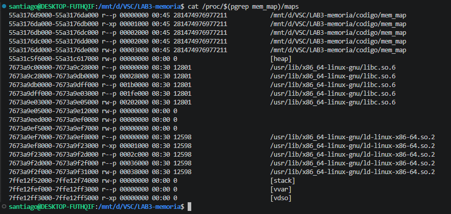
    

2. Compare las direcciones impresas con los rangos de /proc/maps. ¿A qué región pertenece
cada variable?

    Al realizar la ejecucion del codigo se obtiene el siguiente resultado:
    PID del proceso : 5716
    Dir. codigo (main) : 0x55a3176da209
    Dir. global_var : 0x55a3176dd010
    Dir. local_var : 0x7ffe12f7225c
    Dir. heap_var : 0x55a31c5f62a0

    Al comparar cada direccion se puede obtener los siguientes rangos y al frente se coloca la direccion que pertenece a cada rango.
    - 55a3176d9000-55a3176da000 
    - 55a3176da000-55a3176db000  -> Dir. codigo (main) : 0x55a3176da209 (Region text)
    - 55a3176db000-55a3176dc000
    - 55a3176dc000-55a3176dd000
    - 55a3176dd000-55a3176de000  -> Dir. global_var : 0x55a3176dd010 (Region Data)
    - 55a31c5f6000-55a31c617000  -> Dir. heap_var : 0x55a31c5f62a0 (Region heap)
    - 7673a9c00000-7673a9c28000 
    - 7673a9c28000-7673a9db0000 
    - 7673a9db0000-7673a9dff000 
    - 7673a9dff000-7673a9e03000 
    - 7673a9e03000-7673a9e05000 
    - 7673a9e05000-7673a9e12000 
    - 7673a9eed000-7673a9ef0000  
    - 7673a9ef5000-7673a9ef7000 
    - 7673a9ef7000-7673a9ef8000 
    - 7673a9ef8000-7673a9f23000 
    - 7673a9f23000-7673a9f2d000   
    - 7673a9f2d000-7673a9f2f000 
    - 7673a9f2f000-7673a9f31000 
    - 7ffe12f52000-7ffe12f74000  -> Dir. local_var : 0x7ffe12f7225c (Region stack)
    - 7ffe12fef000-7ffe12ff3000 
    - 7ffe12ff3000-7ffe12ff5000

    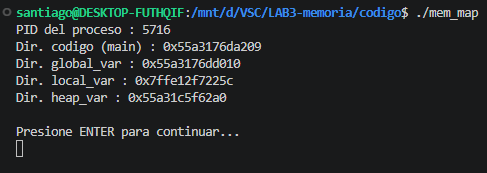

3. ¿Qué otras regiones aparecen en el mapa (libc, [vdso], [vsyscall])? ¿Que función
cumple cada una?

    Otra región que aparece es (data) y es la región donde se almacena global_var.

    libc.so.6: Es la librería estándar de C en la cual se encuentran la mayoría de    funciones, como son: ``printf()``, ``malloc()``, ``scanf()``

    vdso (Virtual Dynamic Shared Object): Es una biblioteca del kernel la cual ayuda a ejecutar ciertas tareas básicas que, debido a su simplicidad, no es necesario realizar una llamada al sistema, sino más bien realizarlas en tiempo de ejecución.

    vvar: Contiene los datos que el vdso necesita para trabajar.

    Cargador Dinámico (Dynamic Linker/Loader)ld-linux: Se encarga de conectar funciones básicas como ``printf()``, ``malloc()``, ``scanf()`` con la ejecución de las demás funciones de mi código; adicionalmente, es como el iniciador del programa, ayudando a que todo funcione de manera unificada.

4. ¿Son las direcciones virtuales iguales a las fisicas? Explique apoyandose en el concepto de address space del OSTEP.

    Según el libro de (Operating Systems: Three Easy Pieces) el (address space) o espacio de direccionamiento se refiere a la abstracción que realiza el sistema operativo en cuanto al espacio de memoria que ocupa un proceso. En este caso, la abstracción consiste en hacerle creer que tiene toda la memoria RAM a su disposición, que empieza en 0 y llega hasta un máximo (por ejemplo, $2^{n}-1$). En cuanto a una dirección virtual, se refiere a la dirección de memoria que se le asigna al proceso, sin embargo, internamente, esta dirección no corresponde a la dirección física, la cual es la verdadera dentro de toda la ejecución del programa. Es por esta abstracción que se puede decir que una dirección virtual no es lo mismo que una dirección física, ya que su valor cambia constantemente.

### 1.4 Actividad: Comparar espacios de dos procesos simultáneos
1. ¿Son las mismas direcciones virtuales en ambos procesos? ¿Qué conclusión saca sobre el
aislamiento del espacio de direcciones?
    En el resultado de la ejecución, las direcciones de memoria son diferentes para cada una de las ejecuciones, por lo cual el S.O. se está encargando de aislar para cada proceso su espacio de memoria, procurando que en cada ejecución no sea igual para evitar que otros procesos choquen con direcciones ya ocupadas o para mejorar la seguridad en cuanto a que no sepa un proceso dónde está ubicado el código de otro. Independientemente de la asignación virtual, el proceso siempre cree que se le está asignando todo el espacio a él, desde la primera dirección hasta la última.

    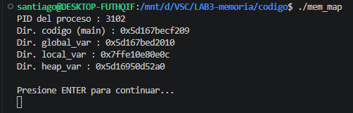
    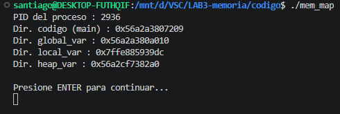

2. ¿Podría el Proceso A leer o modificar la variable global del Proceso B mediante su dirección virtual? Justifique.
    Cada proceso tiene su propia tabla de páginas. Cuando el proceso A intenta acceder a 0x56a2a380a010, la MMU busca en la tabla del proceso A, la cual apunta a una celda de memoria física específica. La tabla del Proceso B apuntará a una celda física completamente distinta, incluso si la dirección virtual es la misma, por lo cual, aunque un proceso conozca de antemano la dirección virtual de la variable global, cuando intenta acceder y modificarla, simplemente no encontrará nada, ya que o estará fuera de su rango de control y se genera algún tipo de excepción o simplemente no encuentra ningún dato, ya que la dirección física será totalmente distinta.

### 2.2 Actividad: Uso correcto de malloc y free

1. Muestre la salida completa de Valgrind. ¿Reporta errores o fugas de memoria? ¿Que significa el mensaje "All heap blocks were freed"?

    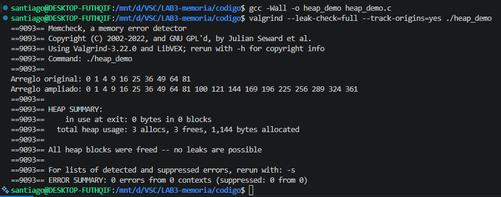
    Según el resultado de la línea ``==9093== ERROR SUMMARY: 0 errors from 0 contexts (suppressed: 0 from 0)`` no se encuentran errores por accesos inválidos, y verificando la línea ``==9093==     in use at exit: 0 bytes in 0 blocks`` no se detectó memoria perdida u olvidada. 

    En cuanto al mensaje ``All heap blocks were freed`` significa que para cada llamada a funciones que reservan memoria en el heap como malloc, calloc o realloc, hubo una llamada correspondiente a free antes de que el proceso terminara.

2. ¿Por qué se usa sizeof(int) en lugar del valor literal 4? ¿Qué ventaja ofrece en portabilidad entre arquitecturas?

    Se usa sizeof(int) en lugar de un valor literal para garantizar la portabilidad y la seguridad del código. Históricamente, el tamaño de un entero depende de la arquitectura: algunos sistemas asignan 2 bytes, otros 4, e incluso algunos pueden asignar más. Al delegar este cálculo al operador sizeof en tiempo de compilación, aseguramos que la asignación de memoria sea la exacta para la arquitectura donde se ejecute el programa. Esto evita tanto el desperdicio de memoria como un posible desbordamiento de memoria (buffer overflow). Además, mejora la mantenibilidad: si en el futuro se cambia el tipo de dato por ejemplo, a double, solo se debe modificar la declaración y no buscar manualmente cada valor literal en el código.

3. ¿Qué devuelve malloc cuando no hay memoria disponible? ¿Por qué es critico verificar ese
valor antes de usarlo?

    En el caso de que se acabe la memoria disponible malloc debe devolver null segun la fuente de IBM ``https://www.ibm.com/docs/es/i/7.6.0?topic=functions-malloc-reserve-storage-block`` en el caso de que no se verifique este valor antes de usarlo, un proceso intentaría acceder a un espacio de memoria que no existe, dependiendo del sistema donde se ejecute, lo más común es que el proceso se finalice de manera abrupta, lo cual no es la mejor presentación para alguien que utilice nuestro programa.

### 2.4 Actividad: Identificar y corregir errores de memoria
1. Transcriba los mensajes que arroja Valgrind. ¿Cual mensaje corresponde a cada uno de los
tres errores clasicos?

    - El primer error está relacionado con buffer overflow en el cual, cuando se llega a la posición i=5, el código ejecuta p[5] = 5. En este caso, se está intentando asignar un valor para una posición que no fue asignada previamente, lo que genera el mensaje de valgring ``==10758== Invalid write of size 4 ==10758== at 0x1091E3: main (buggy_mem.c:10)``

    - El segundo error es relacionado a memory leak en el cual se realizó una reserva de memoria con malloc() cuando se ejecuta el código ``char *q = malloc(100);``, sin embargo, después, durante el resto de la ejecución, ese espacio no fue liberado con la función free(q) por lo cual valgrind detecta esto mediante el mensaje ``==10758== 100 bytes in 1 blocks are definitely lost in loss record 1 of 1``

    - El tercer error relacionado con use-after-free, ocurre cuando liberamos memoria y después necesitábamos utilizar todavía ese espacio reservado. Esto ocurre en el código cuando primero se libera el espacio reservado en p ``free(p);`` e inmediatamente intentamos acceder a ese espacio que ya no está disponible con ``printf("p[0] = %d\n", p[0]);``. Esto lo hace saber valgrind mediante el mensaje ``==10758== Invalid read of size 4 ==10758== at 0x109231: main (buggy_mem.c:20)``

2. Corrija el programa (buggy mem fixed.c) y verifique con Valgrind que no queda ningún
error ni fuga.

    Para corregir el primer error, basta con iterar hasta la posición correcta que se definió en el número de enteros reservados. En este caso, al ser 5 enteros, y debido a que se empieza a iterar desde la posición 0, solamente debemos iterar hasta que i sea menor a 5, con esto se soluciona el error.

    Para el segundo error, lo que se debe realizar es liberar el espacio reservado en el apuntador *q, para ello se verifica que la última invocación de este espacio viene por la utilización de ``printf("%s\n", q);`` por lo cual, después de esto, se debe agregar ``free(q)`` para que ese espacio pueda ser liberado correctamente.

    El último error se soluciona de forma similar al segundo, en este caso si se utiliza la función ``free()`` pero en un lugar incorrecto. Para utilizarla adecuadamente, se debe mover esta función después de la última invocación del apuntador p, lo cual sucede después de realizar la impresión mediante `` printf("p[0] = %d\n", p[0]);``.

    Al realizar estas correcciones, compilar y ejecutar tanto el programa como valgrind se puede observar que no hay errores ni fugas.
    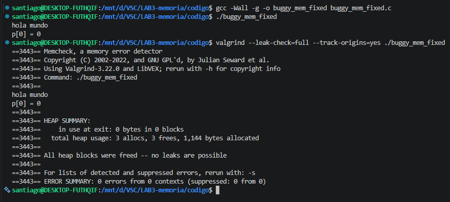

3. ¿Qué consecuencias puede tener un use-after-free en un programa real en términos de seguridad y estabilidad del sistema?

    En términos de seguridad, puede llegar a comprometer datos que estén siendo almacenados en esa posición. Si, por ejemplo, un atacante intenta aprovechar que se realiza un llamado legítimo a esa posición aunque ya no haya información, el atacante podría redirigir el llamado a otros sectores con datos sensibles. En cuanto a la estabilidad, simplemente el programa en ejecución no es confiable, ya que puede pasar que se detenga inesperadamente o que traiga información inconsistente.

### 3.2 Actividad: Base & Bounds — Análisis
1. Compile y ejecute. Muestre la salida completa. ¿Que ocurre al acceder a VA=64 y VA=100
en el Proceso A? ¿Que haria el SO real ante esta excepcion?

    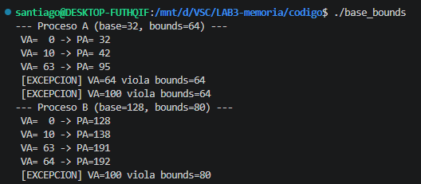
    al acceder a ``VA=64`` no es válida porque ``64 >= 64`` el programa detecta la violación y muestra ``[EXCEPCION] VA=64 viola bounds=64``, de manera similar al acceder a ``VA=100`` no es válida porque ``100 >= 64`` el programa detecta la violación y muestra ``[EXCEPCION] VA=100 viola bounds=64``

    En un sistema operativo moderno, este chequeo no lo hace una función de C, sino la MMU del procesador. Cuando el hardware detecta que un proceso intenta acceder a una dirección fuera de su bounds, en este caso se genera una interrupción de hardware lo que hace que pase de modo usuario a modo kernel, regresándole el control al sistema operativo para que este último gestione esta interrupción.

2. Agregue un Proceso C (base=0, bounds=32) al programa y traduzca las mismas VAs.
¿Puede el Proceso A acceder a las direcciones del Proceso C directamente? Justifique.

    Como se puede ver en la siguiente imagen la mayoría de las direcciones virtuales (63, 64, 100) lanzan una excepción porque superan el límite de 32. Solo las direcciones virtuales pequeñas son válidas para él proceso C
    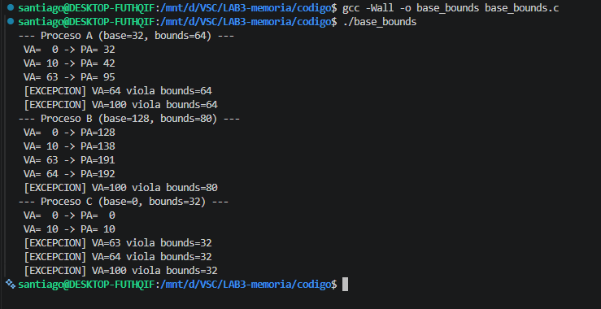

    El proceso A tampoco podría acceder a las direcciones del proceso C, debido a que el proceso A empieza donde finaliza prácticamente el proceso C, el SO detectaría el acceso inválido y generaría una excepción.

3. ¿Cual es la limitacion principal del esquema base & bounds que motiva el surgimiento de la segmentacion?

    La limitación principal es la ineficiencia en el uso de la memoria física, ya que el esquema de base y bound obliga a asignar un bloque contiguo que incluya no solo el código y los datos, sino también todo el espacio vacío entre el stack y el heap. Esto genera un gran desperdicio de memoria física al reservar espacio que el proceso no está utilizando realmente, además de impedir que diferentes partes del programa sean compartidas entre procesos o tengan permisos de seguridad distintos.

### 4 Segmentación
### 4.1 Traducción manual con tabla de segmentos
| Segmento | Base   | Tamaño | Crece |
| -------- | ------ | ------ | ----- |
| Code     | 0x4000 | 2 KB   | +     |
| Heap     | 0x6000 | 3 KB   | +     |
| Stack    | 0x2800 | 2 KB   | -     |

Se realiza la traducción de las direcciones virtuales:
- VA = 0x03A0

Selector: 00 → Segmento Code
Offset: 0x3A0 = 928 (válido)

Cálculo: PA = 0x4000 + 0x3A0 = 0x43A0

- VA = 0x1800

Selector: 01 → Segmento Heap
Offset: 0x800 = 2048 (válido)

Cálculo: PA = 0x6000 + 0x800 = 0x6800

- VA = 0x3C00

Selector: 11 → Segmento Stack
Offset: 0xC00 = 3072 (> 2048)

Resultado: ❌ Excepción (violación de segmento)
- VA = 0x0C00

Selector: 00 → Segmento Code
Offset: 0xC00 = 3072 (> 2048)

Resultado: ❌ Excepción
- VA = 0x2200

Selector: 10 → Segmento inválido

Resultado: ❌ Excepción

### 4.2 Análisis

El segmento Stack crece en dirección negativa porque en la memoria el stack se expande hacia direcciones menores. Por esta razón, el cálculo de la dirección física se realiza restando el offset a la base.

La segmentación permite dividir la memoria en partes lógicas (código, heap, stack), lo que mejora la organización y uso de memoria frente al esquema base & bounds.

La fragmentación externa ocurre cuando existen espacios libres dispersos en memoria que no pueden ser utilizados eficientemente para nuevas asignaciones.

### 5 Paginación
### 5.1 Cálculo de la tabla de páginas

Dado el sistema :

Espacio virtual: 32 bits
Tamaño de página: 4 KB = 2¹²
Espacio físico: 20 bits
Tamaño PTE: 4 bytes

- 1. Bits
Offset = 12 bits
VPN = 32 - 12 = 20 bits

- 2. Número de páginas
     2^20 = 1,048,576 páginas
     
- 3. Tamaño tabla
     1,048,576 × 4 bytes = 4 MB

- 4. PFN y bits de control
PFN = 20 - 12 = 8 bits

Bits de control:

Valid bit → indica si la página está en memoria
Dirty bit → indica si fue modificada
Access bit → indica si fue usada recientemente
Permisos (R/W)

### 5.2 Simulador de paginación
Se ejecutó el programa paging_sim.c obteniendo:

- VA = 0x10
VPN = 1 → no presente
Resultado: PAGE FAULT

-VA = 0xA3
VPN = 10 → PFN = 4
Cálculo:PA = (4 << 4) | 3 = 0x43
Resultado: Dirección física = 0x43

### 5.3 Análisis

Cuando ocurre un page fault, el sistema operativo carga la página desde disco a memoria RAM y actualiza la tabla de páginas.

Una instrucción requiere dos accesos a memoria:
Tabla de páginas
Dato
Esto es costoso, por lo que se utiliza el TLB para acelerar el proceso.
La paginación elimina la fragmentación externa, aunque puede generar fragmentación interna.

### 6 Gestión de espacio libre
### 6.1 Simulación de asignación

Estado inicial :
| Dirección | Tamaño |
| --------- | ------ |
| 0x0100    | 100    |
| 0x0200    | 500    |
| 0x0400    | 200    |
| 0x0500    | 300    |
| 0x0700    | 600    |

- First Fit
malloc(212) → 0x0200 (queda 288)
malloc(417) → 0x0700 (queda 183)
malloc(98) → 0x0100 (queda 2)
malloc(426) → ❌ falla

- Best Fit
malloc(212) → 0x0500 (queda 88)
malloc(417) → 0x0200 (queda 83)
malloc(98) → 0x0100 (queda 2)
malloc(426) → 0x0700 (queda 174)
Sí cambia el resultado.

-Fragmentación
First Fit → más fragmentación
Best Fit → menos fragmentación

-Coalescing
Consiste en unir bloques libres contiguos para formar uno más grande y evitar fallos de asignación.

-Fragmentación interna
Es el espacio desperdiciado dentro de un bloque asignado, común en slab allocator.

### 6.2 Fragmentación en glibc

Las direcciones asignadas no siempre son consecutivas debido a la gestión interna del heap.
La asignación de 1500 bytes puede fallar aunque exista memoria suficiente, debido a fragmentación externa.

-Diferencia de allocators
Usuario (malloc/glibc): gestiona memoria del proceso
Kernel (buddy/slab): gestiona memoria física
Existen ambos niveles para separar responsabilidades y mejorar eficiencia.

### 7.1 Actividad: Localidad y TLB — Análisis

1. ¿Cuántas veces mas lento es el acceso aleatorio frente al secuencial? Muestre el promedio de 3 ejecuciones de tlb locality.

    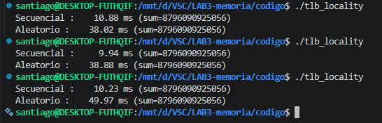
    Para realizar el promedio del acceso secuencial, partimos de los datos obtenidos en tres ejecuciones, los cuales fueron 10.88ms, 9.94ms y 10.23. Al realizar el promedio obtengo 10.35

    Para el acceso aleatorio, de forma similar se obtienen los siguientes tiempos: 38.     02ms, 38.88ms y 49.97ms. Al realizar el promedio se obtiene 42.29ms

    Y al sacar la relación del acceso aleatorio sobre el secuencial, se obtiene 42.29ms/10.35, se obtiene 4.08, con lo que se puede concluir que el acceso aleatorio es 4.08 veces más lento que el secuencial.

2. Explique con el modelo del TLB por qué el acceso aleatorio es mas lento. ¿Qué ocurre con
el hit rate en cada caso?    

    Cuando se hace el acceso secuencial, se recorre el arreglo posición por posición. Eso significa que muchas direcciones virtuales consecutivas caen dentro de la misma página de memoria o en páginas cercanas. Como el TLB guarda las traducciones recientes, una vez se carga una entrada, se reutiliza varias veces antes de cambiar de página.
    En este caso ocurre un alto hit rate en el TLB: la mayoría de accesos encuentran la traducción ya en caché, evitando tener que ir a la tabla de páginas, que es mucho más lenta.

    En cambio, en el acceso aleatorio, cada acceso salta a una posición distinta del arreglo, muy probablemente en páginas diferentes. Esto hace que las entradas del TLB se reemplacen constantemente porque no hay reutilización de las traducciones recientes.
    Aquí ocurre un bajo hit rate: muchos accesos producen TLB misses, obligando al sistema a consultar la tabla de páginas en memoria, lo que introduce más latencia.

3. Si el tamaño de pagina fuera 64 KB en lugar de 4 KB, ¿mejoraría o empeoraría la situación con accesos aleatorios? Justifique desde el punto de vista del TLB y del uso de memoria.

    Desde la perspectiva del Translation Lookaside Buffer, al tener páginas más grandes, cada entrada del TLB cubre una región mayor de memoria. Esto implica que, aunque los accesos sean aleatorios, hay mayor probabilidad de que varias direcciones distintas caigan dentro de la misma página. Como consecuencia, el hit rate del TLB aumentaría y habría menos fallos de traducción (TLB misses), reduciendo el tiempo perdido en consultar la tabla de páginas.

    Sin embargo, desde el punto de vista del uso de memoria, aparece un efecto negativo: la fragmentación interna. Al usar páginas de 64 KB, es más probable que parte de cada página no se utilice completamente, desperdiciando memoria. Además, si los accesos aleatorios están muy dispersos, podrías terminar cargando grandes bloques de memoria de los cuales solo usas una pequeña parte

### 7.2 Actividad: Comportamiento de los TLB

1. Un TLB con 64 entradas (fully associative) y paginas de 4 KB. ¿Cuanta memoria puede
cubrir sin generar misses? ¿Es suficiente para un proceso moderno típico?

    Para calcular cuánta memoria puede cubrir el TLB, se multiplica el número de entradas por el tamaño de página, en este caso ``64×4KB = 256KB``. Es decir, el TLB puede cubrir hasta 256 KB de memoria sin generar fallos (misses), siempre que los accesos se mantengan dentro de ese conjunto de páginas.

    En cuanto a si esto es suficiente para un proceso moderno: en la práctica no lo es. Los programas actuales suelen manejar megabytes o incluso gigabytes de memoria, por lo que 256 KB es una fracción muy pequeña. Esto implica que, el TLB se llenaria rápidamente y comenzarán a ocurrir misses.

2. Consulte: ¿Qué es un TLB shootdown y en que situación ocurre en sistemas multiprocesador? ¿Por qué es una operación costosa?

    Un Translation Lookaside Buffer shootdown es un mecanismo utilizado en sistemas multiprocesador para mantener la coherencia de las traducciones de direcciones cuando cambia el mapeo de memoria virtual a física. Ocurre cuando el sistema operativo modifica la tabla de páginas de un proceso (por ejemplo, al liberar memoria, cambiar permisos o hacer swapping) y necesita asegurarse de que todos los núcleos o CPUs eliminen de sus TLB las entradas antiguas que ya no son válidas. Para lograrlo, el sistema envía interrupciones entre procesadores (IPIs) a los demás núcleos, obligándolos a invalidar esas entradas. Esta operación es costosa porque implica coordinación entre múltiples CPUs, interrupciones que detienen temporalmente la ejecución normal, sincronización para garantizar consistencia y, además, la pérdida de entradas válidas en el TLB, lo que provoca más fallos posteriores y accesos adicionales a la tabla de páginas en memoria, aumentando la latencia general del sistema.

3. Explique la diferencia entre TLB gestionado por hardware (CISC/x86) y por software
(RISC/MIPS). ¿Cuál ofrece mayor flexibilidad al diseñador del SO y por qué?

    En arquitecturas como x86, el Translation Lookaside Buffer es gestionado por hardware: ante un miss, la CPU resuelve automáticamente la traducción consultando la tabla de páginas, lo que es rápido pero poco flexible. En cambio, en arquitecturas como MIPS, el TLB es gestionado por software: el miss genera una excepción y el sistema operativo decide cómo resolverlo, lo que es más lento pero ofrece mayor flexibilidad, ya que el SO puede definir sus propias políticas y estructuras de memoria.

## (c) Problemas presentados durante el desarrollo de la práctica y sus soluciones.
Uno de los principales problemas fue comprender el funcionamiento y la utilidad de Valgrind. La instalación resultó relativamente sencilla; sin embargo, la dificultad estuvo en interpretar los resultados que arroja al ejecutarlo. A medida que se fueron resolviendo las preguntas y realizando pruebas, su utilidad se volvió más clara, especialmente en la detección de errores relacionados con el uso de memoria. Esto es importante porque, en muchas ocasiones, se programa sin tener plena conciencia de cómo se está utilizando la memoria, y Valgrind se convierte en una herramienta muy valiosa para este tipo de depuración.

## (d) Pruebas realizadas a los programas que verificaron su funcionalidad.

En la siguiente imagen se observa la ejecución del programa base y su resultado

Luego el resultado de realizar abrir una segunda terminal y leer el mapa de memoria del proceso mediante el comando cat /proc/$(pgrep mem_map)/maps

Aqui el resultado de tratar de compilar buggy_mem, desde el inicio de se nota que hay problemas de compilacion
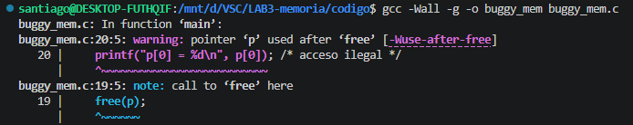

Aqui el resumen del resultado de ejecutar valgrind
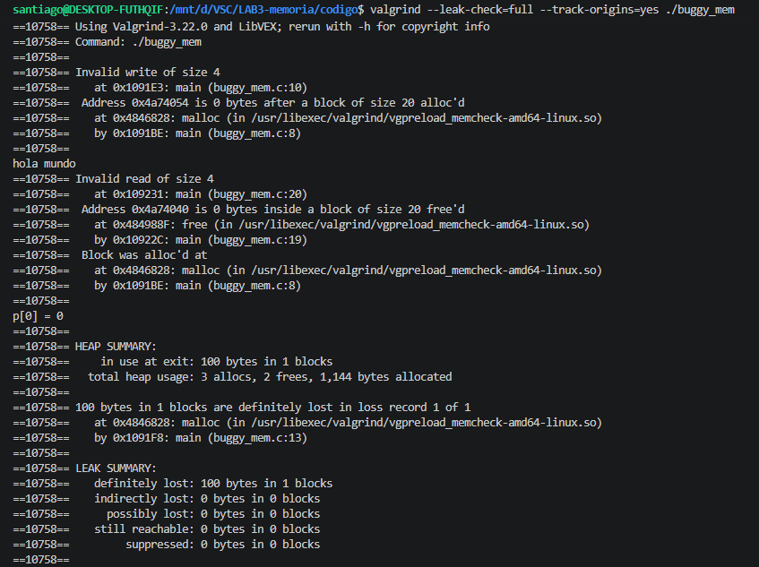

Y este es el resumen del resultado de ejecutar valgrind pero con un codigo corregido

Este seria el resultado de ejecutar base_bound con el codigo suministrado

Este seria el resultado de ejecutar base_bound con un nuevo proceso en el codigo suministrado

Este seria el resultado de ejecutar tlb_locality con el acceso secuencial y aleatorio en tres intentos.

## (e) Un enlace a un video de 10 minutos donde se sustente el desarrollo.

[Haz clic aquí para ver el video](https://youtu.be/kZarcqfpLcY)

## (f) Manifiesto de transparencia: En que puntos se apoyaron de la IA generativa.
Principalmente, se utilizó para entender conceptos dentro de cada forma de acceso a la memoria, con el fin de poder realizar modificaciones en el código cuando alguna pregunta lo requería.
